<p align="center">
  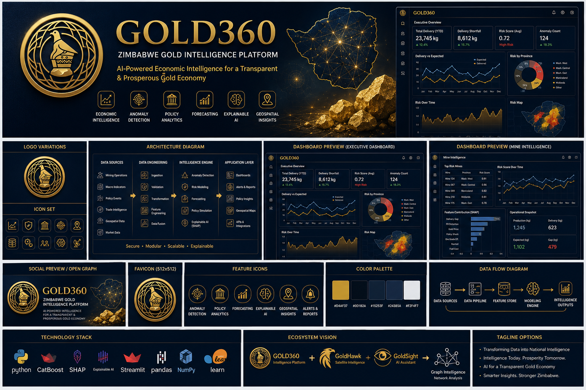
</p>

<p align="center">
  
</p>

<h1 align="center">GOLD360</h1>

<h3 align="center">
AI-Powered Economic Intelligence Platform for Zimbabwe's Gold Value Chain
</h3>

<p align="center">

**Transforming Gold Data into National Intelligence**

</p>

<p align="center">

Economic Intelligence • Machine Learning • Explainable AI • Geospatial Intelligence • Policy Analytics

</p>

---

<p align="center">


</p>

---

# Executive Summary

GOLD360 is an AI-powered economic intelligence platform developed to improve transparency, analytical capability, and strategic decision-making across Zimbabwe's gold value chain.

The platform integrates **economic indicators, mining operations, policy intelligence, geospatial information, trade data, and explainable machine learning** into a unified intelligence framework capable of identifying delivery shortfall risk, structural anomalies, and emerging operational patterns.

Rather than producing isolated dashboards or single-model predictions, GOLD360 combines multiple analytical disciplines into a transparent, modular, and extensible decision-support ecosystem.

---

# The GOLD360 Ecosystem

GOLD360 is a sovereign AI intelligence ecosystem designed to secure Zimbabwe's gold value chain from exploration to export.

Rather than treating illegal mining, production leakage, and mineral traceability as isolated problems, GOLD360 combines economic intelligence, geospatial analytics, artificial intelligence, and computer vision into a unified decision-support platform for governments, regulators, and industry.

The ecosystem consists of three complementary products:

| Platform | Purpose | Status |
|----------|---------|--------|
| **GOLD360** | Hybrid economic intelligence platform that identifies production anomalies, leakage risks, and policy impacts across Zimbabwe's gold sector. | Production MVP |
| **GoldHawk** | Satellite-powered monitoring platform that detects unauthorized mining activity and environmental disturbances using remote sensing and computer vision. | Planned |
| **GoldSight** | AI-powered mobile assistant that estimates gold concentrate quality and yield from smartphone images, bringing field intelligence directly to artisanal miners. | Planned |

Together they create a continuous intelligence loop—from satellites, to mines, to national policy makers—providing actionable insight across the entire gold ecosystem.

# Why GOLD360?

Zimbabwe's gold sector is supported by multiple independent data sources, institutions, and reporting systems. Although each contributes valuable information, they often operate in isolation, making it difficult to build a complete operational picture.

This fragmentation limits the ability to:

- Integrate operational, economic and policy intelligence
- Detect unusual delivery patterns
- Evaluate the potential impact of policy interventions
- Explain why risk signals emerge
- Support evidence-based decision-making using a single analytical platform

GOLD360 addresses these challenges by combining multi-source intelligence into one integrated analytical environment.

---

# Core Objectives

The platform has been designed to:

- Transform fragmented datasets into actionable intelligence
- Identify delivery shortfall risk through hybrid machine learning
- Detect structural anomalies using ensemble methods
- Explain model predictions using SHAP
- Integrate geospatial and policy intelligence
- Support evidence-based regulatory and strategic decision-making
- Provide a scalable foundation for future national mineral intelligence systems

---

# Key Capabilities

| Capability | Description |
|------------|-------------|
| 📊 Economic Intelligence | Integration of macroeconomic, operational and trade indicators |
| 🤖 Machine Learning | CatBoost-based delivery shortfall risk modelling |
| 🔍 Explainable AI | SHAP feature attribution and transparent model interpretation |
| 🛰 Geospatial Intelligence | Spatial analysis and regional risk visualisation |
| ⚠️ Hybrid Anomaly Detection | Ensemble anomaly detection using multiple algorithms |
| 🧩 Weak Supervision | Proxy label generation for partially observable systems |
| 📈 Forecasting | Trend estimation and temporal analysis |
| 🏛 Policy Intelligence | Scenario evaluation and policy impact analysis |
| 🧱 Modular Architecture | Extensible platform supporting future intelligence modules |

---

# GOLD360 Intelligence Workflow

```text
Economic Data
        │
Mining Operations
        │
Policy Events
        │
Trade Intelligence
        │
Geospatial Data
        │
        ▼
Data Pipeline
        ▼
Feature Engineering
        ▼
Weak Supervision
        ▼
Hybrid Anomaly Detection
        ▼
Machine Learning
        ▼
Explainable AI
        ▼
Scenario Analysis
        ▼
Geospatial Intelligence
        ▼
Executive Decision Support
```

---

# Platform Highlights

- Multi-source data fusion
- Explainable machine learning
- Hybrid anomaly detection
- Policy-aware intelligence
- Geospatial risk analysis
- Scenario simulation
- Interactive Streamlit dashboards
- Modular research architecture
- Reproducible analytical workflows

---

# Dashboard Showcase

The following sections present the core analytical components of the GOLD360 platform.

---

# 🖥️ Dashboard Showcase

The GOLD360 dashboard is organized as a sequence of intelligence modules that guide users from **raw data ingestion** to **evidence-based decision support**.

Unlike conventional business intelligence dashboards that simply visualize historical information, GOLD360 combines **data engineering, machine learning, anomaly detection, explainable AI, geospatial analytics, and policy simulation** into a unified analytical workflow.

---

## Executive Overview

<p align="center">
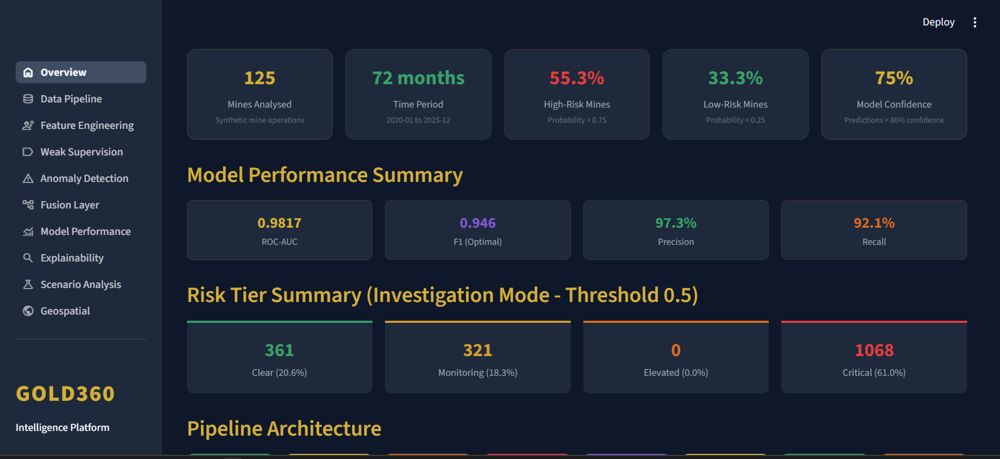
</p>

The Executive Overview serves as the platform's operational command center, providing high-level visibility into system status, intelligence outputs, model performance, delivery risk, and analytical workflows.

---

# Data Foundation

Reliable intelligence begins with reliable data. This layer transforms fragmented datasets into a unified analytical foundation.

| Data Pipeline | Feature Engineering |
|:-------------:|:-------------------:|
| 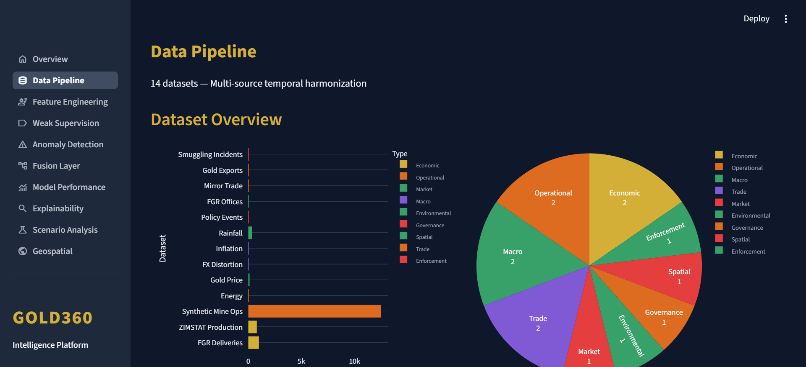 | 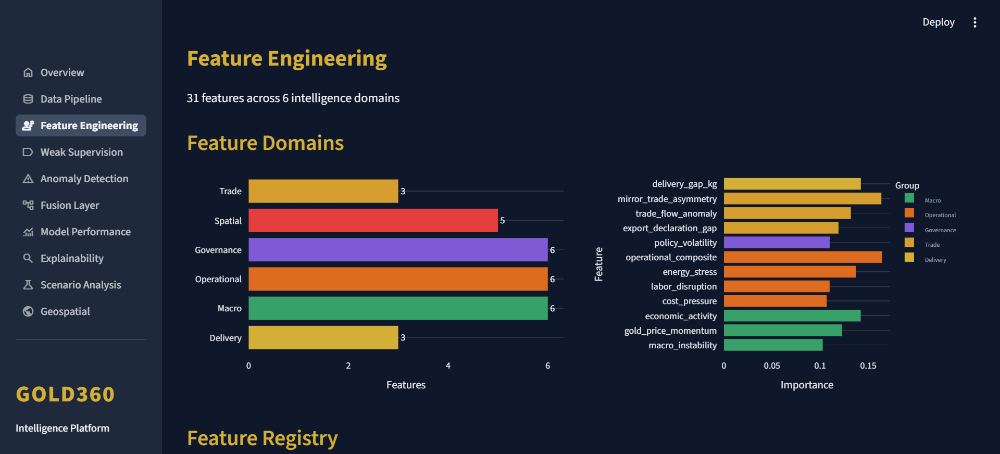 |

### Data Pipeline

- Multi-source data ingestion
- Temporal harmonisation
- Dataset validation
- Missing value handling
- Standardisation
- Data lineage

### Feature Engineering

- Feature generation
- Rolling statistics
- Lag features
- Economic indicators
- Policy features
- Operational metrics

---

# Intelligence Generation

Once data has been prepared, GOLD360 generates probabilistic intelligence using hybrid learning techniques.

| Weak Supervision | Hybrid Anomaly Detection |
|:----------------:|:------------------------:|
| 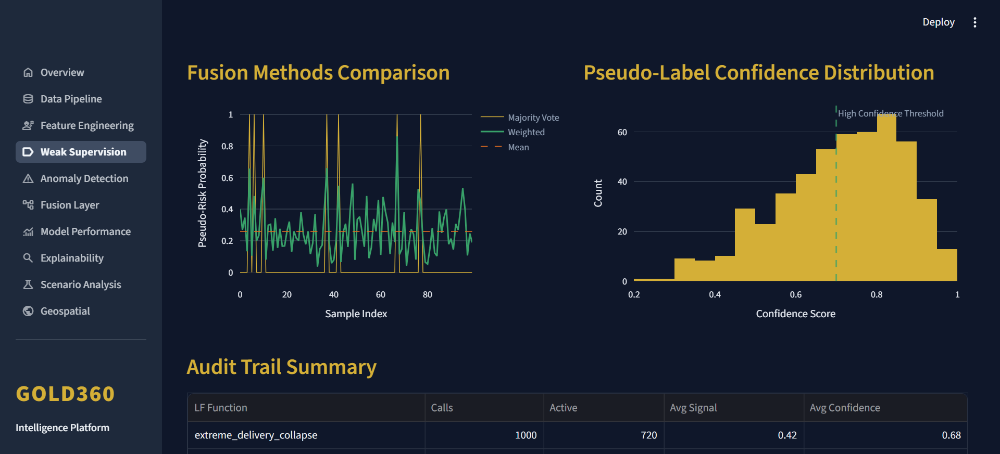 | 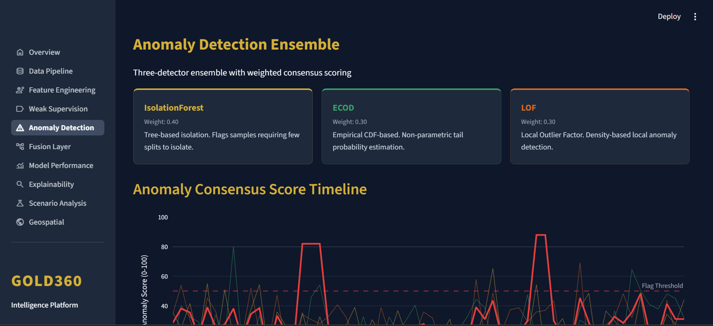 |

### Weak Supervision

Generates proxy intelligence labels where verified observations are limited.

### Hybrid Anomaly Detection

Combines multiple complementary anomaly detection algorithms to identify structural deviations and unusual operational behaviour.

---

# Intelligence Fusion

<p align="center">
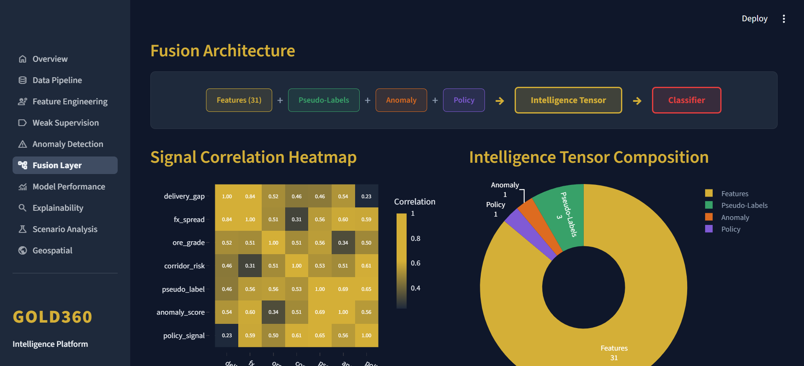
</p>

The Fusion Layer integrates signals from multiple intelligence modules into a single analytical representation, improving robustness, consistency, and interpretability.

---

# Model Validation & Explainability

| Model Performance | Explainable AI |
|:-----------------:|:--------------:|
| 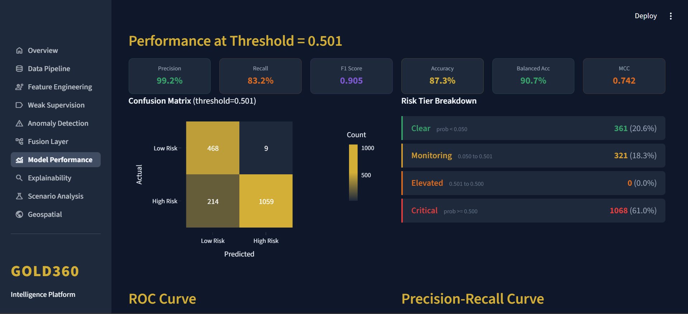 |  |

Model outputs remain fully transparent through SHAP-based explainability, enabling analysts to understand the key drivers behind every prediction.

---

# Decision Intelligence

## Scenario Analysis

<p align="center">
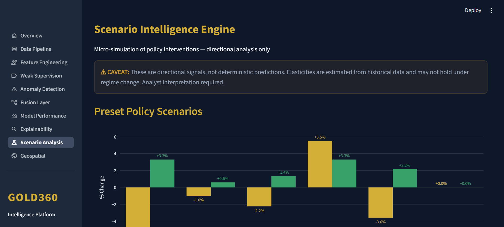
</p>

The Scenario Analysis module allows users to evaluate the potential effects of policy changes, operational assumptions, and macroeconomic conditions on delivery shortfall risk and overall system behaviour.

---

## Geospatial Intelligence

<p align="center">
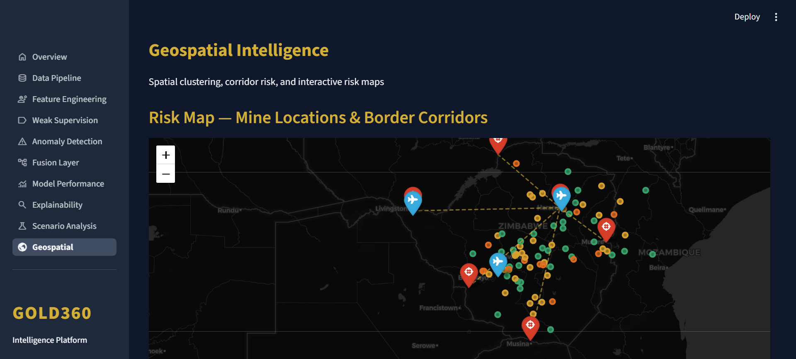
</p>

The Geospatial Intelligence module visualizes regional risk patterns, mine distribution, operational hotspots, and spatial trends to support evidence-based monitoring and strategic decision-making.

---

The final intelligence layer enables analysts to:

- Evaluate policy interventions
- Compare historical and projected outcomes
- Explore regional risk patterns
- Monitor operational performance
- Support evidence-based strategic decision making

---

# End-to-End Analytical Workflow

```text
Raw Data
    │
    ▼
Data Pipeline
    │
    ▼
Feature Engineering
    │
    ▼
Weak Supervision
    │
    ▼
Hybrid Anomaly Detection
    │
    ▼
Intelligence Fusion
    │
    ▼
CatBoost Risk Modelling
    │
    ▼
Explainable AI (SHAP)
    │
    ▼
Scenario Analysis
    │
    ▼
Geospatial Intelligence
    │
    ▼
Executive Decision Support
```

---

---

# 🏗️ System Architecture

GOLD360 is designed as a modular intelligence platform rather than a single machine learning model. Each analytical layer performs a distinct role, allowing the platform to remain transparent, reproducible, and extensible.

```text
                     GOLD360

        AI-Powered Economic Intelligence Platform

 ┌───────────────────────────────────────────────────────┐
 │                 Executive Dashboard                   │
 └───────────────────────────────────────────────────────┘
                          ▲
                          │
 ┌───────────────────────────────────────────────────────┐
 │      Explainable AI • SHAP • Decision Support         │
 └───────────────────────────────────────────────────────┘
                          ▲
                          │
 ┌───────────────────────────────────────────────────────┐
 │      CatBoost Risk Classification Engine              │
 └───────────────────────────────────────────────────────┘
                          ▲
                          │
 ┌───────────────────────────────────────────────────────┐
 │     Hybrid Anomaly Detection Ensemble                 │
 │   Isolation Forest • ECOD • Local Outlier Factor      │
 └───────────────────────────────────────────────────────┘
                          ▲
                          │
 ┌───────────────────────────────────────────────────────┐
 │ Weak Supervision • Feature Engineering • Data Fusion  │
 └───────────────────────────────────────────────────────┘
                          ▲
                          │
 ┌───────────────────────────────────────────────────────┐
 │ Economic • Operational • Policy • Spatial Data        │
 └───────────────────────────────────────────────────────┘
```

---

# 🌍 Why GOLD360 is Different

Most mining analytics platforms focus on reporting historical information.

GOLD360 has been designed as an **Economic Intelligence Platform**, integrating multiple analytical disciplines into a single decision-support ecosystem.

| Traditional Analytics | GOLD360 |
|------------------------|----------|
| Static reports | Interactive intelligence platform |
| Historical dashboards | Predictive & scenario-driven analytics |
| Single data source | Multi-source intelligence fusion |
| Operational data only | Economic, policy, operational & spatial intelligence |
| Black-box predictions | Explainable AI using SHAP |
| Descriptive reporting | Decision-support intelligence |
| Manual interpretation | Automated anomaly detection |
| Independent tools | End-to-end analytical workflow |

---

# 💡 Research Contributions

GOLD360 introduces a hybrid analytical framework for improving visibility across partially observable commodity ecosystems.

### Key contributions include:

- Hybrid Economic Intelligence Framework
- Weakly Supervised Learning for Limited-Label Environments
- Delivery Shortfall Risk Modelling
- Policy-Aware Intelligence
- Explainable Machine Learning using SHAP
- Multi-Source Data Fusion
- Geospatial Intelligence Integration
- Modular AI Architecture for National Resource Governance

---

# ⭐ Platform Components

## 📊 Economic Intelligence

Integrates macroeconomic indicators including:

- Inflation
- Exchange rates
- Gold prices
- Trade statistics
- Energy indicators
- Rainfall
- Production trends

---

## ⛏️ Operational Intelligence

Monitors:

- Mine production
- Gold deliveries
- Recovery performance
- Operational efficiency
- Delivery residuals
- Production consistency

---

## 🏛️ Policy Intelligence

Tracks and analyses:

- Regulatory changes
- Fiscal interventions
- Policy events
- Institutional reforms
- Historical policy impacts
- Scenario simulations

---

## 🛰️ Geospatial Intelligence

Provides:

- Regional risk mapping
- Spatial anomaly visualisation
- Province-level intelligence
- Corridor analysis
- Geographic trend exploration

---

## 🤖 Machine Learning

The platform combines supervised and unsupervised learning approaches.

Core models include:

- CatBoost
- Isolation Forest
- ECOD
- Local Outlier Factor (LOF)

Supporting methods include:

- Weak Supervision
- SHAP Explainability
- Feature Engineering
- Residual Modelling

---

# 📁 Repository Structure

```text
gold360/
│
├── README.md                     Repository homepage
│
├── gold360_v3/
│   ├── app/                      Streamlit application
│   ├── assets/                   Branding & dashboard images
│   ├── config/                   Configuration files
│   ├── data/                     Raw & processed datasets
│   ├── docs/                     Technical documentation
│   ├── gold360/                  Core platform source code
│   ├── models/                   Trained ML models
│   ├── notebooks/                Research notebooks
│   ├── outputs/                  Generated figures & reports
│   ├── reports/                  Model evaluation reports
│   ├── scripts/                  Automation scripts
│   └── tests/                    Unit & integration tests
│
└── research_audits/              Independent validation studies
```

---

# 📚 Documentation

The repository includes comprehensive technical documentation covering the complete lifecycle of the platform.

| Document | Description |
|----------|-------------|
| Architecture | System architecture and design |
| Data Lineage | Dataset provenance and governance |
| Feature Registry | Engineered feature catalogue |
| Model Governance | Model lifecycle and monitoring |
| Data Pipeline | End-to-end processing workflow |
| Experiment Tracking | Reproducibility framework |
| Streamlit Platform | Dashboard specification |
| Configuration | System configuration |
| Research Audits | Independent validation studies |

---

> **Design Philosophy**

GOLD360 is built around four guiding principles:

- **Transparency** — Every prediction should be explainable.
- **Reproducibility** — Every experiment should be traceable.
- **Modularity** — Every intelligence layer should be independently extensible.
- **Decision Support** — Models generate probabilistic intelligence, not definitive conclusions.

---
---

# 📈 Results & Empirical Validation

GOLD360 has been evaluated using multiple complementary validation techniques to assess predictive performance, model robustness, explainability, and analytical reliability. Rather than relying on a single metric, the platform combines statistical validation, feature attribution, leakage testing, and forecasting accuracy to provide a comprehensive assessment of model performance.

---

## Executive Model Performance

<p align="center">
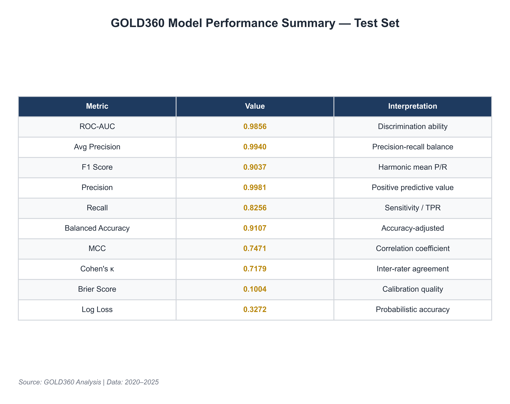
</p>

The executive performance dashboard summarizes the overall predictive capability of the GOLD360 framework, including ROC-AUC, Precision, Recall, F1 Score, and overall classification quality.

---

## Receiver Operating Characteristic (ROC)

<p align="center">
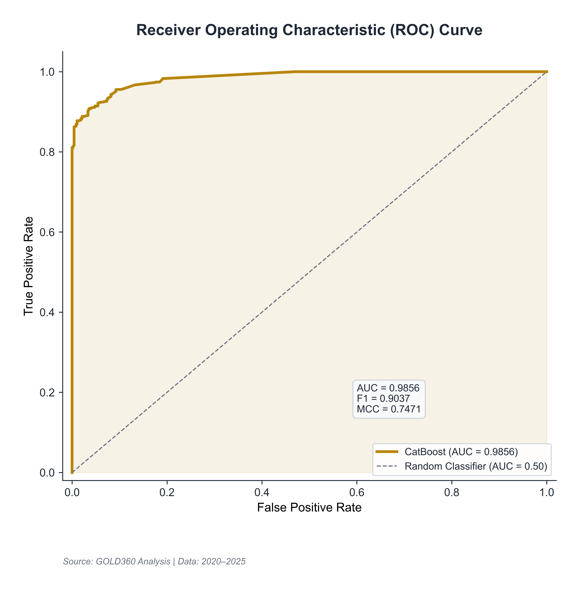
</p>

The ROC curve demonstrates the model's ability to distinguish between higher-risk and lower-risk delivery scenarios across different decision thresholds.

---

## Precision–Recall Performance

<p align="center">
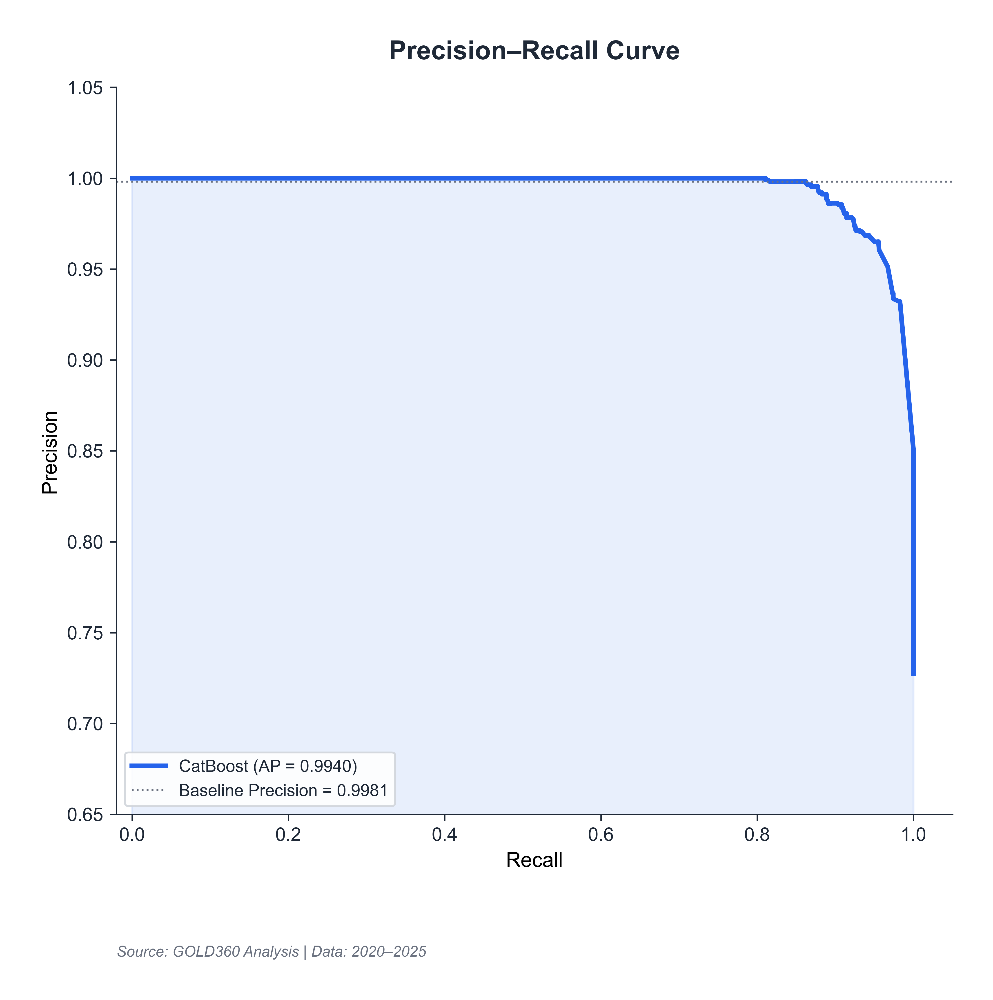
</p>

Precision–Recall analysis provides a more informative evaluation under class imbalance, which is particularly important when detecting relatively rare but high-impact anomalies.

---

## Confusion Matrix

<p align="center">
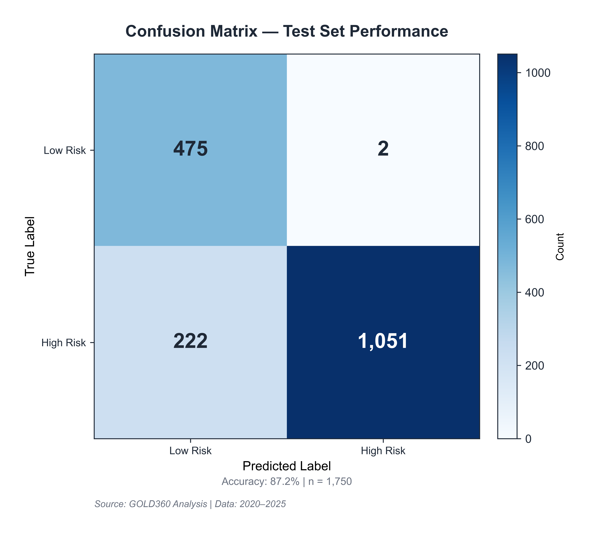
</p>

The confusion matrix illustrates classification performance by comparing predicted outcomes against observed outcomes, highlighting both successful classifications and model errors.

---

## Explainable Artificial Intelligence (SHAP)

<p align="center">
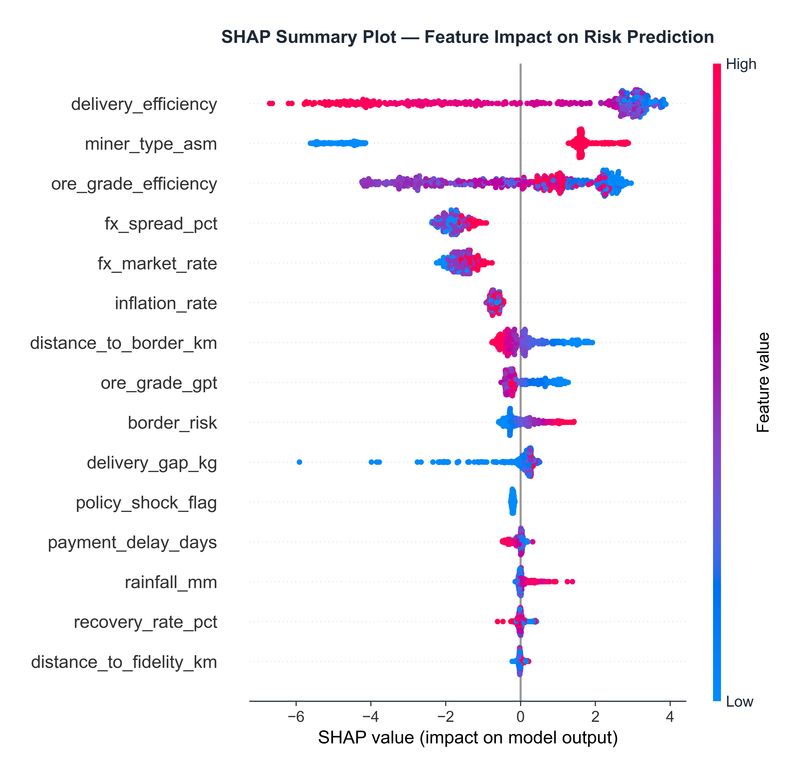
</p>

SHAP analysis explains individual model predictions by quantifying the contribution of each feature to the predicted delivery risk, improving transparency and analyst confidence.

---

## Feature Importance

<p align="center">
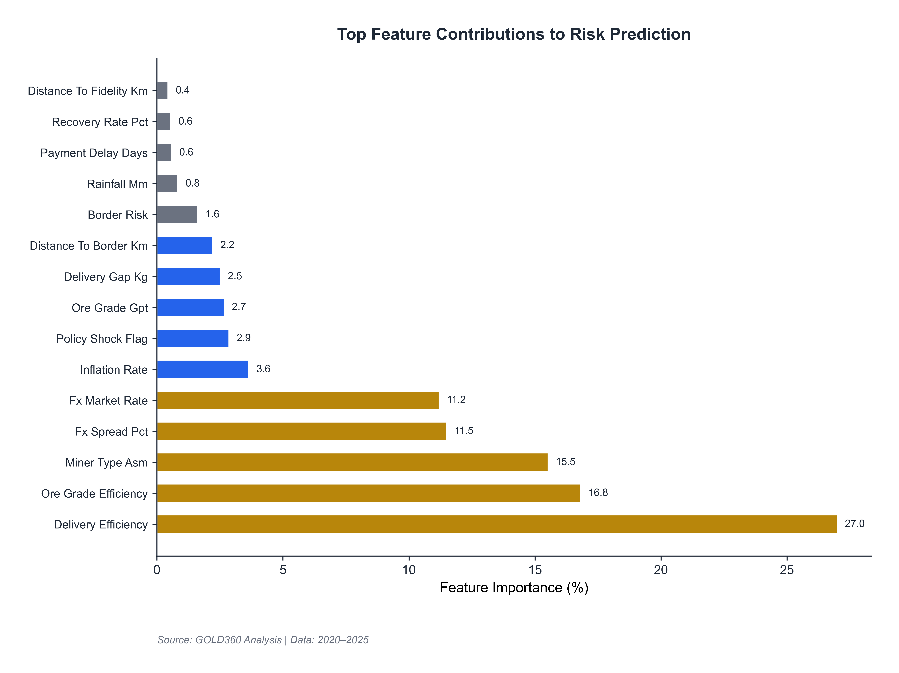
</p>

Feature contribution analysis identifies the operational, economic, policy, and spatial variables that most strongly influence predicted delivery shortfalls.

---

## Delivery Gap Distribution

<p align="center">
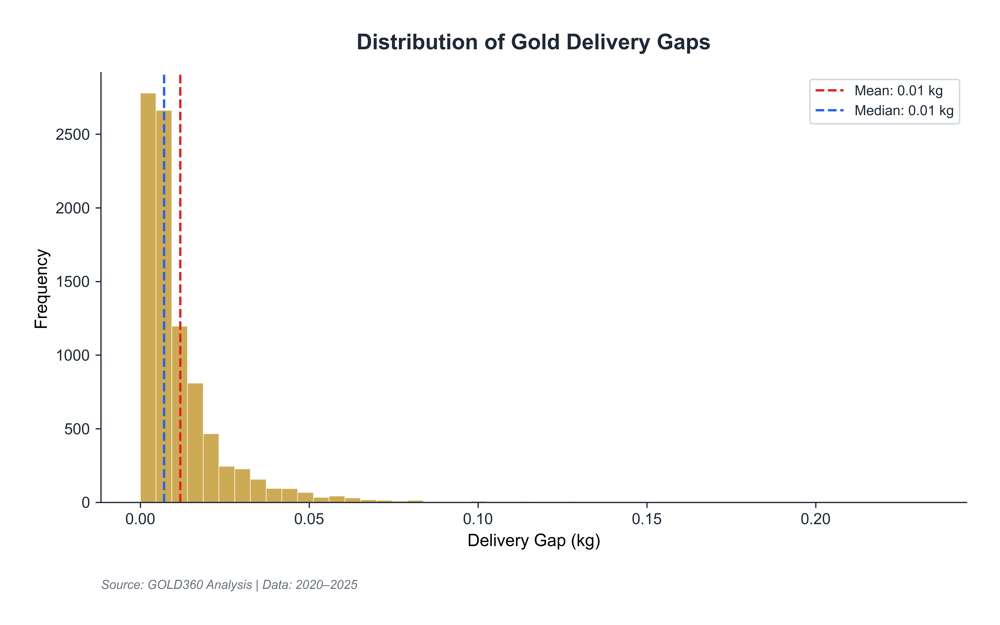
</p>

The delivery-gap distribution illustrates the magnitude and variability of discrepancies between expected and observed gold deliveries across the study period.

---

## Risk Category Distribution

<p align="center">
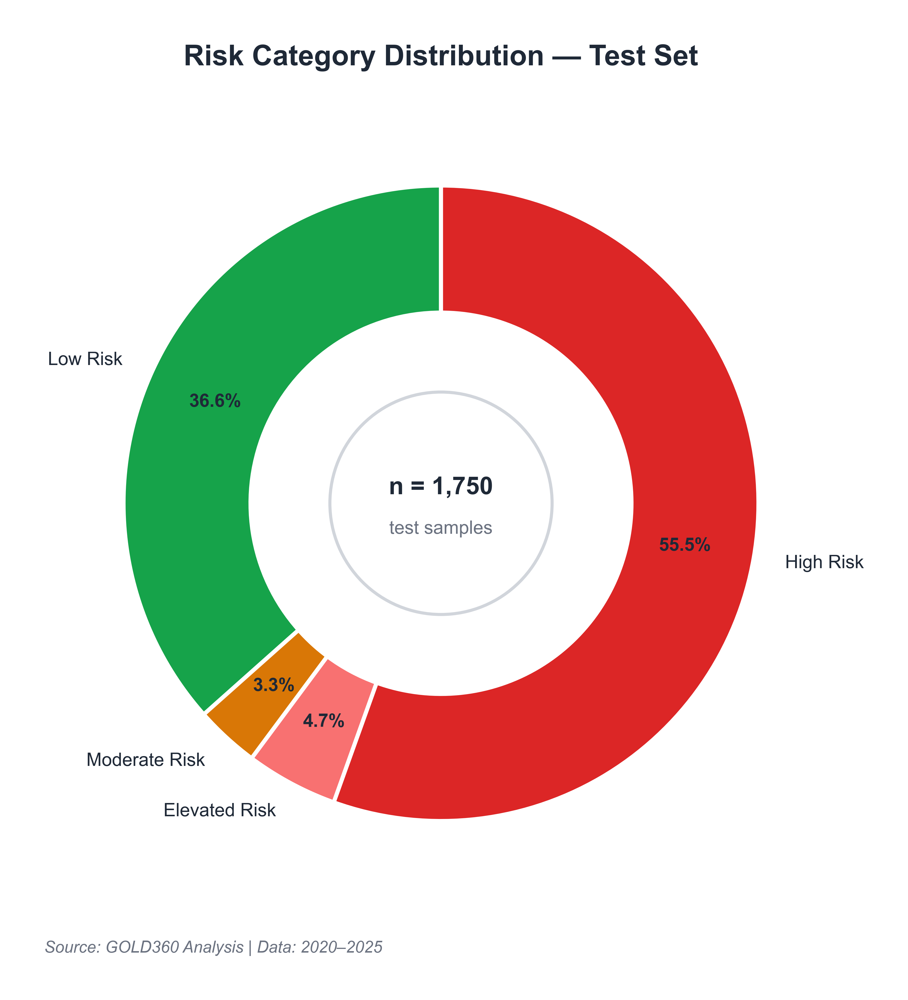
</p>

Predicted observations are grouped into operational risk tiers, enabling analysts to prioritize monitoring and intervention efforts.

---

## Leakage Validation

<p align="center">
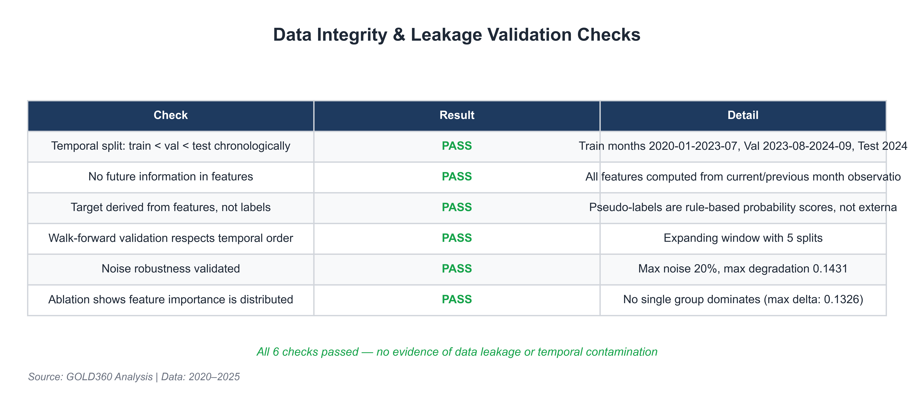
</p>

Leakage validation confirms that the predictive models avoid information leakage between training and evaluation stages, strengthening confidence in reported performance.

---

## Forecast Accuracy

<p align="center">
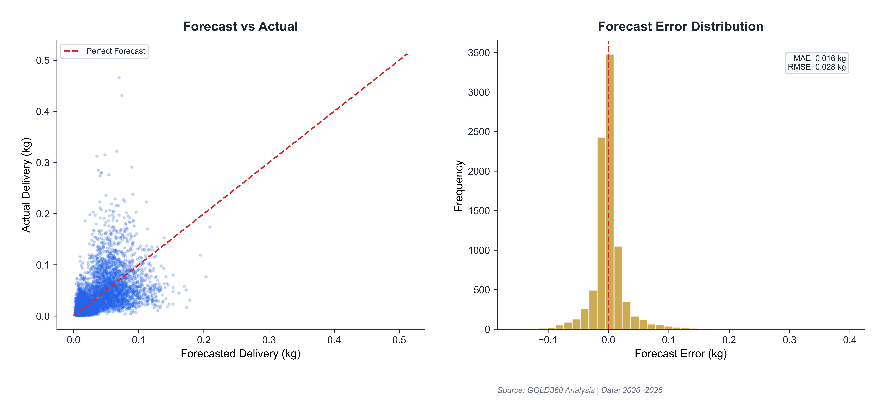
</p>

Forecast validation compares predicted delivery behaviour against observed outcomes, providing evidence of temporal consistency and generalisation performance.

---

# Research Validation Summary

| Validation Component | Status |
|----------------------|:------:|
| ROC Analysis | ✅ |
| Precision–Recall Analysis | ✅ |
| Confusion Matrix Evaluation | ✅ |
| SHAP Explainability | ✅ |
| Feature Importance Analysis | ✅ |
| Leakage Validation | ✅ |
| Forecast Validation | ✅ |
| Cross Validation | ✅ |
| Robustness Testing | ✅ |
| Overfitting Assessment | ✅ |

---

> **Research Note**

GOLD360 is designed as an **AI-powered economic intelligence and decision-support platform**. Its outputs represent probabilistic intelligence signals intended to support analysts, policymakers, and researchers. The platform does not provide legal determinations or definitive evidence of illicit activity, but instead prioritizes transparency, explainability, and reproducible analytical workflows.

---

---

# 🏗️ System Architecture

GOLD360 is built as a modular intelligence platform that transforms fragmented economic, operational, spatial, and policy information into explainable risk intelligence.

Unlike conventional analytical systems that rely on isolated machine learning models, GOLD360 integrates multiple analytical layers into a unified decision-support pipeline.

<p align="center">

</p>

The platform follows a layered architecture consisting of:

| Layer | Purpose |
|--------|---------|
| Data Sources | Multi-source ingestion of mining, economic, spatial and policy datasets |
| Data Engineering | Cleaning, harmonisation and validation |
| Feature Engineering | Construction of operational, economic and governance indicators |
| Weak Supervision | Generation of probabilistic labels using domain knowledge |
| Hybrid Anomaly Detection | Identification of statistically unusual behaviour |
| Fusion Intelligence Layer | Integration of multiple analytical signals |
| CatBoost Risk Model | Supervised delivery shortfall prediction |
| Explainability | SHAP-based interpretation of model outputs |
| Scenario Engine | Policy simulation and impact assessment |
| Executive Dashboard | Interactive decision-support interface |

---

# ⚙️ Core Technologies

| Component | Technology |
|-----------|------------|
| Programming Language | Python |
| Dashboard | Streamlit |
| Machine Learning | CatBoost |
| Weak Supervision | Snorkel |
| Anomaly Detection | Isolation Forest, ECOD, LOF |
| Explainability | SHAP |
| Data Processing | Pandas, NumPy |
| Visualisation | Plotly, Matplotlib |
| Geospatial Analysis | Folium |
| Version Control | Git & GitHub |

---

# 📂 Repository Structure

```text
gold360
│
├── gold360_v3
│   ├── assets/
│   │   ├── branding/
│   │   └── dashboard/
│   │
│   ├── config/
│   ├── data/
│   │   ├── raw/
│   │   ├── processed/
│   │   └── synthetic/
│   │
│   ├── gold360/
│   │   ├── models/
│   │   ├── features/
│   │   ├── pipeline/
│   │   ├── explainability/
│   │   └── dashboard/
│   │
│   ├── outputs/
│   │   ├── figures/
│   │   ├── reports/
│   │   └── models/
│   │
│   ├── reports/
│   ├── scripts/
│   ├── tests/
│   ├── README.md
│   └── requirements.txt
│
└── research_audits/
```

---

# 📚 Documentation

The repository contains comprehensive documentation covering the complete development lifecycle of the platform.

| Document | Purpose |
|----------|---------|
| ARCHITECTURE.md | Overall system architecture |
| DATA_LINEAGE.md | Data provenance and governance |
| FEATURE_REGISTRY.md | Feature definitions and engineering |
| CONFIGURATION.md | Configuration reference |
| MODEL_EVALUATION_REPORT.md | Model evaluation methodology |
| Research Audits | Independent validation studies |

---

# 🔬 Design Principles

GOLD360 is guided by five engineering principles:

- **Transparency** — Every prediction should be explainable.
- **Reproducibility** — Research should be independently reproducible.
- **Scalability** — Components should be modular and extensible.
- **Evidence-Based Intelligence** — Decisions should be supported by measurable evidence.
- **Human-Centred Decision Support** — AI assists analysts rather than replacing them.

---
# Product Roadmap

## Current Generation

✅ GOLD360 Core Intelligence Platform

- Weak Supervision
- Hybrid Machine Learning
- Explainable AI
- Scenario Analysis
- Geospatial Intelligence
- Policy Intelligence

---

## Next Generation

🛰 GoldHawk

Satellite Intelligence

- Illegal mining detection
- Change detection
- Environmental monitoring
- Remote sensing
- Early warning

---

📱 GoldSight

Field Intelligence

- Ore quality estimation
- Yield prediction
- WhatsApp integration
- Mobile computer vision
- Ground-truth collection

---

## Future Vision

The long-term vision is a sovereign mineral intelligence network capable of supporting gold, lithium, chrome, platinum and other strategic minerals across Africa.

